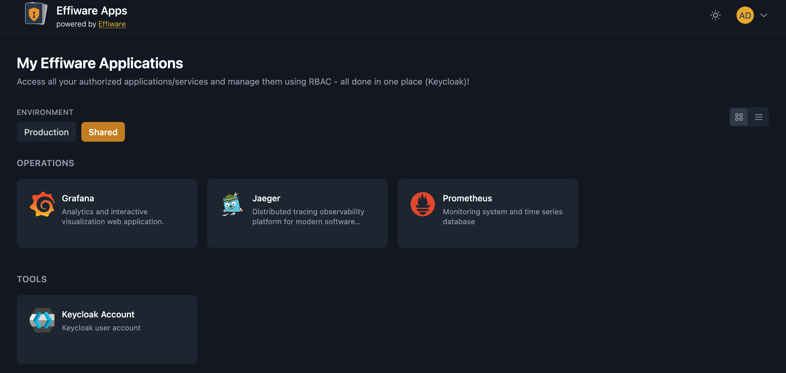
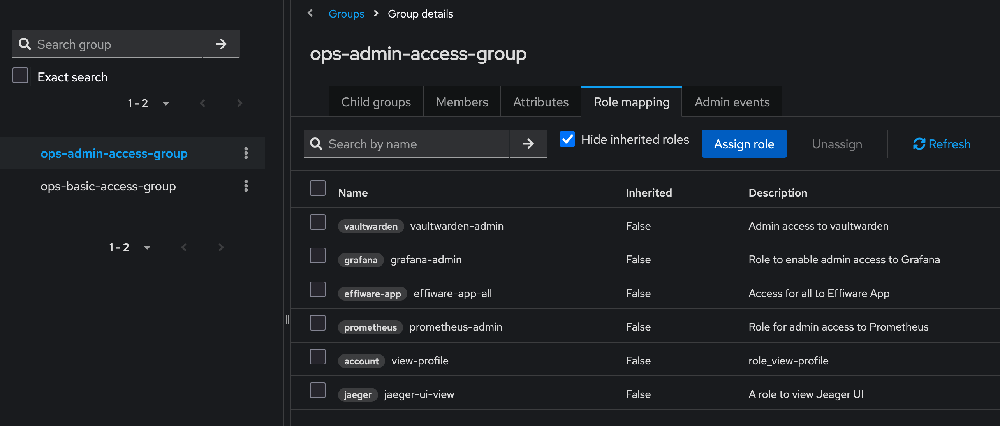

# Cloak Apps

[](https://go.dev/doc/go1.25)
[](https://templ.guide)
[](https://tailwindcss.com)
[](https://htmx.org)
[](https://alpinejs.dev)

An internal application portal for organization engineers, similar to Okta's app integration dashboard but natively supporting Keycloak SSO. Built as a Hypermedia-Driven Application (HDA) using the GOTH stack.

## Overview

Cloak Apps serves as a centralized hub where users can access all applications they have permission to use. Keycloak acts as the single source of truth for authentication and role-based access control (RBAC).

**Key Features:**
- [x] Keycloak SSO integration for authentication
- [x] Application grouping by space (operations, tools, mvp, etc.)
- [x] Environment filtering (production, development, all)
- [x] Dark/light mode support
- [x] Card and list view modes
- [x] Type-safe templates with Templ
- [x] Hypermedia-driven architecture with HTMX
- [x] OpenTelemetry tracing and Prometheus metrics (`/metrics`)

Built from the [Effiware GOTH template](https://github.com/Effiware/goth-template).

## Screenshots

<table>
  <tr>
    <td></td>
    <td></td>
  </tr>
  <tr>
    <td align="center"><em>Application Portal</em></td>
    <td align="center"><em>Keycloak RBAC</em></td>
  </tr>
</table>

## Quick Start

### Prerequisites

- Go v1.25+
- npm v11.4+
- node v24.4+
- Air v1.63.0 (for hot reload)
- Templ CLI 0.3.943
- GNU Make 3.81 (optional)

Or use Docker 28.1+

---

## Development Setup

### Option 1: Local Machine

1. **Install dependencies**
   ```bash
   make prep
   ```

2. **Build Tailwind and Go**
   ```bash
   make build-local
   ```

3. **Run the application** with Hot Reload using Air 
   ```bash
    make air
    ```

### Option 2: Docker (Recommended)

Either do `make prep` (will also install Go/Node dependencies on the host machine) or copy `.env.example` to `.env` and modify as needed.

1. **Generate certificates**
   ```bash
   make gen-certs
   ```

2. **Build the Docker image**
   ```bash
   make docker-build
   ```

3. **Run the Docker container**
   ```bash
   make docker-up
   ```

4. **Stop the Docker container**
   ```bash
   make docker-down
   ```

### Add hostnames to your local DNS resolver

If you're on Mac or linux simply add below line to your `/etc/hosts`

```txt
127.0.0.1    keycloak
```

### Import sample realm

The app as is uses a realm called **cloak-apps-realm**, the easies way to start using the project is to create a new
realm in Keycloak with the same name and import (seed) the default data from [cloak-apps-realm-export.json](seed/cloak-apps-realm-export.json)

You should be able to log in to admin console on `https://localhost/admin` - it uses self-signed certificates so you
have to accept potential risk alert in the browser.

Detailed information is available in [KEYCLOAK_CONFIGURATION.md](./KEYCLOAK_CONFIGURATION.md)

---

## Access the Application

In `.env` file there are port overwrites with the default setup. You shouldn't need to change them but there is always
a possibility to do so.

Docker Compose includes Keycloak plus the full observability stack — Grafana, Loki, Tempo, Alloy and Prometheus:

| Service | URL | Purpose |
|---|---|---|
| Keycloak | `https://localhost` | Auth and RBAC |
| Grafana | `http://localhost:8083` | The only UI you need — logs, traces, metrics |
| Prometheus | `http://localhost:8084` | Metric storage |
| Loki | `http://localhost:8085` | Log storage (query via Grafana) |
| Tempo | `http://localhost:8086` | Trace storage (query via Grafana) |
| Alloy | `http://localhost:8087` | Collector — tails container logs, receives OTLP |

Grafana runs with anonymous admin access locally and its datasources are provisioned from `_grafana/`, so there is
nothing to click through

Open your browser and navigate to `http://localhost:<app-port>` (default is 8080).

---

## Observability

The app emits **JSON logs on stdout**, **OTLP traces** and **Prometheus metrics**, per the Auditee instrumentation
contract. Alloy is the only collector: it tails container stdout into Loki and forwards spans to Tempo. Never point
the app at Tempo directly.

```
CLOAKAPPS_OTLP_URL=alloy:4317      # alloy.ops.svc.cluster.local:4317 in the cluster
CLOAKAPPS_OTLP_PROTOCOL=grpc       # or "http" against :4318
OTEL_SERVICE_NAME=cloak-apps       # must equal the pod's app.kubernetes.io/name label
```

`OTEL_EXPORTER_OTLP_ENDPOINT` is honoured too and takes precedence — when it is set the exporter ignores
`otlp.url`/`otlp.secure` entirely and the env URL's scheme decides TLS.

### Log fields

One compact JSON object per line. `trace_id` and `span_id` are added automatically from the context by a `slog`
handler wrapper — but only for `…Context` calls, so **pass `ctx`**: `slog.InfoContext(ctx, …)`, never `slog.Info(…)`.

| Field | Notes |
|---|---|
| `level`, `msg`, `time` | Always present. `msg` is constant — variables go in their own fields |
| `service`, `env`, `instance` | Constant identity on every line |
| `trace_id`, `span_id` | On every line emitted inside a request |
| anything else | snake_case, stable types, flat. Never secrets, tokens or personal data |

Users are identified by `user_sub` (the opaque Keycloak `sub`), never by username — logs leave the pod and are kept
14 days.

### Verifying the links

In Grafana → Explore → Loki:

```logql
{namespace="dev-v1", app="cloak-apps"}                        // lines arriving at all?
{namespace="dev-v1", app="cloak-apps"} | json | level="ERROR" // is the JSON parseable?
{namespace="dev-v1"} | json | trace_id != ""                  // is the trace ID present?
```

Expand a line from the last query — it carries a **TraceID** link into Tempo, and the span's **Logs for this span**
must come back to the same lines. Both directions, or it isn't working.

If a direction comes back empty it is almost always one of three things: the key isn't spelled `trace_id`, the JSON
isn't compact, or `OTEL_SERVICE_NAME` doesn't match `app.kubernetes.io/name` (Grafana maps the span's `service.name`
onto the Loki `app` label).

Locally, `LOG_NAMESPACE` in `.env` stands in for the K8s namespace and the compose labels
(`app.kubernetes.io/name`, `namespace`) stand in for the pod labels, so the queries above run unchanged.

---

## Documentation

- [CLAUDE.md](CLAUDE.md) - Project architecture and design decisions
- [TODO.md](TODO.md) - Future implementation phases and roadmap
- [OBSERVABILITY-PLAN.md](OBSERVABILITY-PLAN.md) - Alignment with the Auditee instrumentation contract
